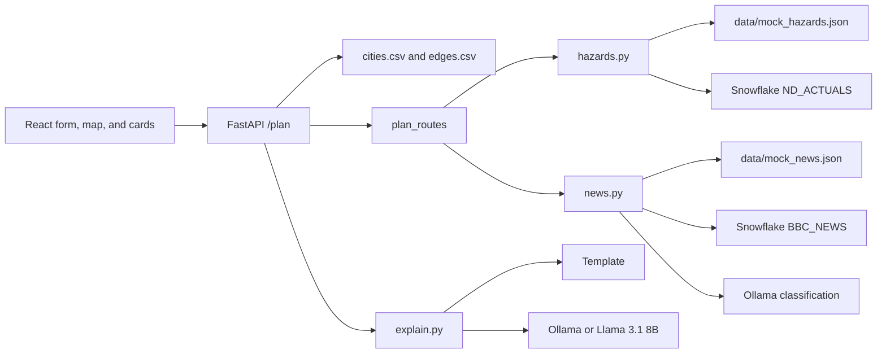

# Chokepoint

Chokepoint ranks truck routes between major US cities. You give a start city, an end city, and a deadline. The app returns a fastest path and up to three alternatives scored from drive time, natural-hazard records, and news. An optional as-of date replays only the records known by the end of that day.

The counts and hours are calculations. A historical replay is evidence about those past cases. It is not a guarantee that a later disruption would be avoided.

## Architecture



| Piece | Role |
| --- | --- |
| `frontend` | Form, Leaflet map, route cards, backtest page, score panel |
| `backend/app/api` | `/plan`, `/cities`, `/city/{name}/risk`, `/health`, `/backtest` |
| `backend/app/routing` | City catalog, hop graph, k-shortest paths |
| `backend/scoring.py` | Hazard and news delay, deadline check, ranking |
| `backend/hazards.py` | Disaster rows and the 0–1 hazard score |
| `backend/news.py` | News rows, local classification cache, 0–1 news score |
| `backend/explain.py` | Plain-English notes from the computed facts |
| `backend/snowflake_client.py` | Read-only Snowflake connection |
| `scripts/backtest.py` | Historical replay written to `data/backtest_report.json` |

The same routes are also mounted under `/api`. A calendar `as_of_date` means the end of that UTC day. Hazard and news queries keep rows dated on or before that instant and drop anything later.

`USE_MOCK_DATA=true` reads `data/mock_hazards.json` and `data/mock_news.json` and does not call Snowflake or Ollama. Explanations then come from a template filled with the same scores.

## Setup

Python 3.11 or newer, Node, and npm. From the repo root:

```bash
cp .env.example .env
make install-backend
make install-frontend
python scripts/seed_demo.py
```

`scripts/seed_demo.py` checks the city list, road hops, mock hazards, and mock news. If `data/cities.csv` or `data/edges.csv` is missing, it builds them with `scripts/build_edges.py`. It does not overwrite files that are already present.

## One-command startup

After the install step above:

```bash
make dev
```

That checks the demo files, then starts the API on `http://127.0.0.1:8000` and the UI on `http://127.0.0.1:5173`. Ctrl+C stops both. `make backend` and `make frontend` start them separately. `make test` runs the Python tests.

## Mock mode

In `.env`:

```bash
USE_MOCK_DATA=true
```

Restart the API after changing it. The UI shows a banner when mock mode is on. Health then reports Snowflake and Ollama as `skipped`.

To use live tables instead, set `USE_MOCK_DATA=false` and fill in the Snowflake settings below. Ollama has to be running if you want live news classification or model-written explanations. If either service is down, the plan still returns and the response `warnings` field says which scores were left out.

## Backtest

From the repo root, with mock data:

```bash
python scripts/backtest.py
```

The script picks past disaster events from the local hazard file. For each event it plans five sample routes through the affected area, using only records dated on or before three days before the event. It writes `data/backtest_report.json` and prints a table: events tested, routes whose fastest path entered the later danger zone, how many proposed routes left those cities, and the average extra drive hours on the routes that left.

The Backtest page in the UI reads that file. It does not recompute the routes. Replay loads one saved sample into the planner. `--live` leaves `USE_MOCK_DATA` as it is in the environment. The default run forces mock files so the replay does not depend on a warehouse.

## Environment variables

| Variable | Used for |
| --- | --- |
| `USE_MOCK_DATA` | Local files instead of Snowflake and Ollama. Default true when unset. |
| `SNOWFLAKE_ACCOUNT`, `SNOWFLAKE_USER`, `SNOWFLAKE_PASSWORD`, `SNOWFLAKE_WAREHOUSE` | Connection. Required for live mode. |
| `SNOWFLAKE_DATABASE`, `SNOWFLAKE_SCHEMA`, `SNOWFLAKE_ROLE` | Optional session settings. |
| `SNOWFLAKE_DISASTER_TABLE` | Hazard table. Default is the Ambee `ND_ACTUALS` name in `snowflake_client.py`. |
| `SNOWFLAKE_NEWS_TABLE` | News table. Default `BBCGOOGLECNN_NEWS_LISTING.PUBLIC.BBC_NEWS`. |
| `OLLAMA_BASE_URL`, `OLLAMA_MODEL` | Local model. Default `http://localhost:11434` and `llama3.2`. |
| `EXPLAIN_PROVIDER` | `ollama` or `cloud`. |
| `CLOUD_MODEL_BASE_URL`, `CLOUD_MODEL_API_KEY`, `CLOUD_MODEL_NAME` | OpenAI-compatible endpoint. Default model name `meta-llama/Llama-3.1-8B-Instruct`. |
| `NEWS_CACHE_PATH` | Optional path for the classification cache. |
| `REQUEST_TIMEOUT_SECONDS` | HTTP budget before 504. Default 60. |
| `VITE_API_BASE_URL` | API origin for the UI. Default `http://127.0.0.1:8000`. |

Score weights live in `DEFAULT_WEIGHTS` in `backend/scoring.py` (drive 1, hazard 8, news 4). They are not environment variables. The How scores work panel in the UI shows the formula.

Leave `.env` uncommitted. `.gitignore` already excludes it.

## How we used Snowflake

Snowflake is the live source for hazards and news when mock mode is off.

- The client opens a session from the `SNOWFLAKE_*` variables and closes it when the query finishes. Login timeout is 8 seconds and network timeout is 15 seconds.
- Every statement goes through `assert_select_only`. A query must be one `SELECT` or `WITH`. Inserts, updates, deletes, and other write verbs are rejected.
- Table names are split on dots and each part has to match an identifier pattern. They are not pasted in from the request.
- Hazard SQL keeps events whose start is at or before `as_of`. News SQL keeps articles whose `published_at` is after the lookback start and at or before `as_of`. Those cutoffs are bound parameters.
- The hazard table is Ambee's `ND_ACTUALS`. The news table is `BBC_NEWS` from the BBC, Google, and CNN news listing. Place names are not columns on the news table, so a row matches when the city or state name appears in the headline or content.
- Article bodies are read only long enough to classify an uncached id. SQLite stores the classification. API responses contain the source id, headline, and date, not the article text.
- `GET /health` runs `SELECT 1` outside mock mode. If Snowflake or Ollama cannot be reached, health is `degraded` and a plan returns partial scores plus `warnings` instead of failing the request.

## How we used open source AI

The model does not choose the route or set the weights.

- News classification calls local Ollama (`llama3.2` by default). The prompt asks for a small JSON object: whether the article is relevant, an event type, a severity from 0 to 3, and whether it affects road travel. Those fields feed the news score in `backend/news.py`.
- Route explanations use the same Ollama model when `EXPLAIN_PROVIDER=ollama`. `EXPLAIN_PROVIDER=cloud` calls an OpenAI-compatible endpoint. The default cloud model name is `meta-llama/Llama-3.1-8B-Instruct`, an open-weight Llama model.
- The explanation prompt is the instruction file in `.agents/skills/explain-route/assets/instructions.md` plus a JSON object of cities, scores, events, headlines, and hours. A check rejects an answer that mentions a city or number that was not in that object. One retry is allowed. If the model is down, mock mode is on, or the answer still fails the check, the API uses a template built from the same facts and says so in `explanation_source`.

## Data sources

- Hazard events in live mode: Ambee Global Natural Disasters, historical and present conditions, table `ND.ND_ACTUALS`, via the Snowflake Marketplace.
- News in live mode: BBC, Google, and CNN news listing, table `PUBLIC.BBC_NEWS`, via the Snowflake Marketplace. Headlines shown in the app are the source headlines. Article bodies are not stored in the cache or returned by the API.
- Road network: city coordinates and 2020 Census city populations compiled in `scripts/build_edges.py`. Hop miles are great-circle distance. Drive hours use 55 mph. This is not a street-level road network.
- Map tiles: OpenStreetMap (`© OpenStreetMap contributors`).
- Mock hazards and mock news: local demo records in `data/mock_hazards.json` and `data/mock_news.json`, used when `USE_MOCK_DATA=true`.
- Language models: [Ollama](https://ollama.com/) and Llama 3.2 / Llama 3.1 8B Instruct weights. See the model licenses for those weights.

## License

MIT. See [LICENSE](LICENSE).
