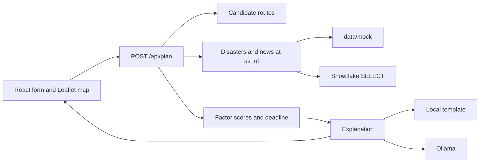

# Chokepoint

Chokepoint is a delivery route risk planner. A planner enters a start city, an end city, and a deadline. The app proposes two or three truck routes through major US cities, scores each one from natural-disaster data and news, and says whether the deadline holds.

Distances, hours, and risk numbers are computed in Python. An optional local language model only turns those numbers into plain-English explanations and has to cite the records it was given.

## Architecture



| Piece | Role |
| --- | --- |
| `backend/app/routing` | City catalog, road-mile estimates, hop graph, 2–3 candidate routes |
| `backend/app/sources` | Disasters and news, from local files or read-only Snowflake |
| `backend/app/scoring` | Named factors, deadline check, rank by travel time plus risk |
| `backend/app/llm` | Explanations that cite the structured result |
| `backend/app/pipeline.py` | One plan request from end to end |
| `backend/app/api` | FastAPI request and response models, `/api/health` and `/api/plan` |
| `frontend` | Form, ranked routes, factor breakdown, map |
| `data/mock` | Local cities, disasters, and news used when mock mode is on |

`as_of` is the replay clock. It is required on `POST /api/plan` and passed into every source, score, and explanation call. A row dated after `as_of` is outside that replay.

`USE_MOCK_DATA=true` keeps both Snowflake and Ollama out of the process. Sources read `data/mock`, and the explanation is a template filled from the same factor and citation objects.

## Data flow

1. The request names a start city, an end city, a deadline (`deadline_at` or `deadline_days`), and `as_of`.
2. The city catalog resolves both names. The hop graph links cities about 150–350 road miles apart. The route generator returns up to three paths.
3. Disaster and news loaders pull records known at `as_of` along those paths.
4. Scoring writes a factor breakdown (`hazard_risk`, `news_risk`, `delay_hours`, `travel_hours`, `deadline_slack_hours`), an ETA, and `meets_deadline`.
5. Routes are ordered by `total_cost_hours` (driving hours plus risk cost).
6. The explanation step receives that structure and returns prose plus citations. The API returns the routes, the factors, and the prose together.

The build order and the formula for each factor are in [docs/PLAN.md](docs/PLAN.md).

## How to run

Python 3.11 or newer, Node, and npm. From the repo root:

```bash
cp .env.example .env
make install-backend
make install-frontend
make backend
```

In a second terminal:

```bash
make frontend
```

- API: `http://127.0.0.1:8000` (`/api/health`, `/api/plan`)
- UI: `http://127.0.0.1:5173`
- Config: repo-root `.env` (see `.env.example`). The frontend reads `VITE_API_BASE_URL` from that same file.

This checkout is the skeleton. Handler and feature functions raise `NotImplementedError` until the steps in `docs/PLAN.md` land. Mock CSV and JSON files are in place with headers and empty arrays.

Leave `.env` uncommitted. `.gitignore` already excludes it.
